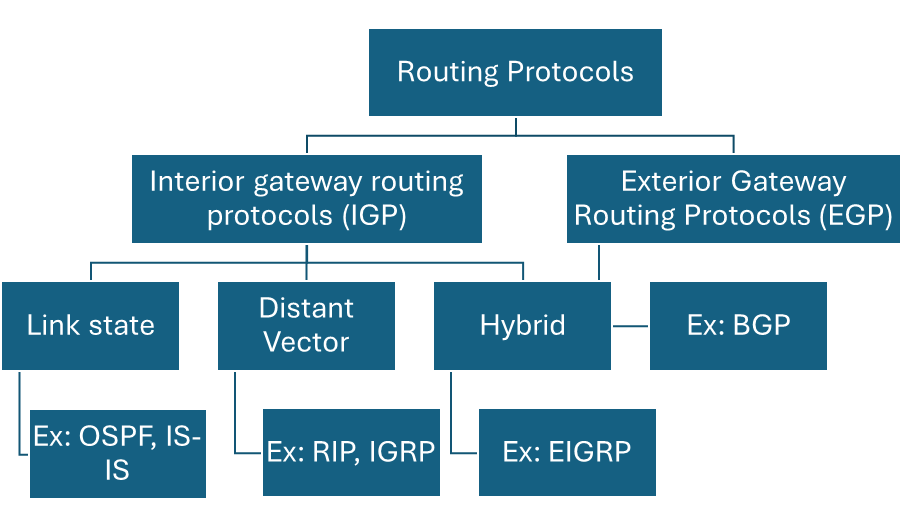

import { Image } from "astro:assets";
import myPhoto from "./images/my-photo.png";

# IP Routing and Routing Protocols

## Definition

**IP Routing** is the process of forwarding IP packets from one network to another using **routers**. Routers determine the best path to the destination network by consulting their **routing tables**.

---

## Key Points

### What is IP Routing?

- IP routing allows communication between **different networks**.
- Routers examine the **destination IP address** of each packet.
- Routers determine the **best next-hop** using the routing table.
- The packet is then forwarded toward its destination.

### Example

```text
PC A
192.168.1.10
     │
     │
Router R1
     │
     │
Router R2
     │
PC B
10.1.1.20
```

The routers forward the packet until it reaches the destination network.

---

# Routing Table

## Definition

A **Routing Table** is a database maintained by a router that contains information about reachable networks and the paths used to reach them.

### Characteristics

- Stored in **RAM**.
- Used to determine the **next hop**.
- Updated manually (static routing) or automatically (dynamic routing).

---

## Information Stored in a Routing Table

Typical entries include:

- Destination network
- Subnet mask (prefix)
- Next-hop IP address
- Exit interface
- Routing protocol
- Administrative Distance (AD)
- Metric

---

# Types of Routing

There are three common types of routing:

1. Static Routing
2. Default Routing
3. Dynamic Routing



---

# Static Routing

## Definition

**Static Routing** is a routing method where the network administrator manually configures routes on every router.

The router does **not** learn routes automatically.

---

## Advantages

- Low CPU usage
- No routing protocol traffic (no bandwidth overhead)
- Better security
- Simple for very small networks
- Predictable routing behavior

---

## Disadvantages

- Manual configuration required
- Difficult to maintain
- Poor scalability
- Every topology change requires manual updates
- Not suitable for large networks

---

## Static Route Configuration

### Using Next-Hop IP

```bash
Router(config)# ip route <destination-network> <subnet-mask> <next-hop-IP>
```

Example

```bash
R1(config)# ip route 192.168.10.0 255.255.255.0 192.168.20.1
```

**Explanation**

- `ip route` → Creates a static route.
- `192.168.10.0` → Destination network.
- `255.255.255.0` → Subnet mask.
- `192.168.20.1` → Next-hop router.

---

### Using Exit Interface

```bash
Router(config)# ip route <destination-network> <subnet-mask> <exit-interface>
```

Example

```bash
R1(config)# ip route 192.168.10.0 255.255.255.0 Serial2/0
```

The router forwards packets through the specified interface.

---

## Verify Static Routes

```bash
show ip interface brief
```

Displays interface status.

---

```bash
show ip route
```

Displays the routing table.

---

```bash
show ip route static
```

Displays only static routes.

---

```bash
show running-config | include ip route
```

Shows configured static routes.

---

```bash
show ip protocols
```

Displays routing protocol information.

---

```bash
show ip route <network> <mask>
```

Displays a specific route.

> **Note:** In networking, a **Network ID (NID)** is often referred to as a **prefix**.

---

# Default Routing

## Definition

A **Default Route** is used when the router does not know a specific route to the destination network.

It is commonly configured on **stub routers**.

---

## Stub Router

A **Stub Router** has only **one path** leading out of the local network.

---

## Default Route Configuration

```bash
Router(config)# ip route 0.0.0.0 0.0.0.0 <next-hop-IP | exit-interface>
```

Example

```bash
R1(config)# ip route 0.0.0.0 0.0.0.0 192.168.1.1
```

This route matches **any unknown destination**.

---

## Verify Default Routing

```bash
debug ip packets
```

Displays packet forwarding information.

---

```bash
debug ip routing
```

Displays routing updates and routing decisions.

---

# Dynamic Routing

## Definition

**Dynamic Routing** uses routing protocols to automatically discover networks and exchange routing information between routers.

Routers update their routing tables whenever the network topology changes.

---

## Functions of Dynamic Routing Protocols

- Discover neighboring routers
- Exchange routing information
- Build routing tables
- Update routes automatically
- Determine the best path

---

## Advantages

- Automatic updates
- Suitable for large networks
- Easier administration
- Supports redundant paths
- Automatically adapts to failures

---

## Disadvantages

- Uses CPU resources
- Consumes network bandwidth
- More complex than static routing

---

# Routed Protocol vs Routing Protocol

## Routed Protocol

### Definition

A **Routed Protocol** carries user data across networks.

Examples:

- IPv4
- IPv6
- IPX
- AppleTalk

---

## Routing Protocol

### Definition

A **Routing Protocol** allows routers to exchange routing information and determine the best paths.

Examples:

- RIP
- OSPF
- EIGRP
- IS-IS
- BGP

---

## Comparison

| Routed Protocol           | Routing Protocol              |
| ------------------------- | ----------------------------- |
| Carries user data         | Exchanges routing information |
| Used by hosts and routers | Used only by routers          |
| Example: IPv4             | Example: OSPF                 |

---

# Components of a Routing Protocol

## 1. Algorithm

Determines the best route to a destination.

Examples:

- Hop Count
- Cost
- Bandwidth
- Delay

---

## 2. Routing Messages

Used to:

- Discover neighbors
- Exchange routing information
- Update routing tables

---

# Classification of Routing Protocols

Routing protocols are divided into:

```text
Routing Protocols
│
├── Interior Gateway Protocols (IGP)
│     ├── Distance Vector
│     ├── Link State
│     └── Hybrid
│
└── Exterior Gateway Protocols (EGP)
      └── BGP
```

---

# Interior Gateway Protocol (IGP)

## Definition

IGP protocols operate **within a single organization or autonomous system (AS)**.

Examples:

- RIP
- OSPF
- EIGRP
- IS-IS

---

# Exterior Gateway Protocol (EGP)

## Definition

EGP protocols exchange routing information **between different autonomous systems**, such as between Internet Service Providers (ISPs).

Example:

- BGP (Border Gateway Protocol)

---

# Distance Vector Routing Protocols

## Definition

Distance Vector protocols determine the best path primarily based on **distance**, commonly measured by **hop count**.

Examples:

- RIP
- IGRP (Cisco proprietary; obsolete)

---

## Characteristics

- Uses **Hop Count**
- Periodically sends the **entire routing table**
- Sometimes called **"Routing by Rumor"**
- Simple but slower to converge

---

## Hop Count

Every time a packet passes through a router, it counts as **one hop**.

Example:

```text
PC
 │
R1
 │
R2
 │
R3
 │
Server
```

Hop Count = **3**

---

# Link-State Routing Protocols

## Definition

Link-State protocols maintain a complete view of the network topology and calculate the shortest path using the **Shortest Path First (SPF)** algorithm.

Examples:

- OSPF
- IS-IS

---

## Router Databases

A Link-State router maintains:

1. Neighbor Table
2. Link-State Database (network topology)
3. Routing Table

---

## Characteristics

- Sends updates only when changes occur.
- Builds a complete network map.
- Uses **Cost** as its metric (OSPF).
- Fast convergence.

---

# Hybrid Routing Protocols

## Definition

Hybrid protocols combine features of both **Distance Vector** and **Link-State** routing.

Example:

- EIGRP (Enhanced Interior Gateway Routing Protocol)

---

## Characteristics

- Fast convergence
- Efficient updates
- Supports multiple metrics
- Cisco proprietary in its original implementation

---

# Distance Vector vs Link-State

| Feature        | Distance Vector             | Link-State                      |
| -------------- | --------------------------- | ------------------------------- |
| Network View   | Partial                     | Complete                        |
| Updates        | Periodic full-table updates | Triggered updates after changes |
| Convergence    | Slower                      | Faster                          |
| Resource Usage | Lower                       | Higher                          |
| Examples       | RIP, IGRP                   | OSPF, IS-IS                     |

---

# Classful Routing Protocols

## Definition

Classful routing protocols **do not include subnet mask information** in routing updates.

Requirements:

- All subnets must use the same subnet mask.

Examples:

- RIPv1
- IGRP

---

# Classless Routing Protocols

## Definition

Classless routing protocols **include subnet mask information** in routing updates.

Advantages:

- Support Variable Length Subnet Masks (VLSM)
- Support CIDR (Classless Inter-Domain Routing)

Examples:

- RIPv2
- OSPF
- EIGRP
- IS-IS

---

## Classful vs Classless

| Classful                  | Classless                 |
| ------------------------- | ------------------------- |
| No subnet mask in updates | Includes subnet mask      |
| No VLSM support           | Supports VLSM             |
| Less flexible             | More flexible             |
| RIPv1, IGRP               | RIPv2, OSPF, EIGRP, IS-IS |

---

# Metric

## Definition

A **Metric** is a value used by a routing protocol to determine the **best path** to a destination.

The route with the **lowest metric** is generally preferred.

---

## Metrics Used by Routing Protocols

| Routing Protocol | Metric                                                                   |
| ---------------- | ------------------------------------------------------------------------ |
| RIP              | Hop Count                                                                |
| OSPF             | Cost (based primarily on bandwidth in Cisco implementations)             |
| IGRP             | Bandwidth, Delay, Reliability, Load                                      |
| EIGRP            | Bandwidth and Delay (by default); can also consider Reliability and Load |

---

# Administrative Distance (AD)

## Definition

**Administrative Distance (AD)** measures the **trustworthiness of the source** of routing information.

- Range: **0–255**
- Lower AD = More trusted
- AD **255** = Route is never used

---

## Default Administrative Distance Values

| Route Source        | Default AD |
| ------------------- | ---------: |
| Connected Interface |          0 |
| Static Route        |          1 |
| EIGRP (Internal)    |         90 |
| IGRP                |        100 |
| OSPF                |        110 |
| RIP                 |        120 |
| EIGRP (External)    |        170 |
| Unknown             |        255 |

---

## Example

If a router learns the same route through both OSPF and RIP:

| Protocol |  AD |
| -------- | --: |
| OSPF     | 110 |
| RIP      | 120 |

The router selects the **OSPF** route because it has the lower Administrative Distance.

---

# Gateway of Last Resort

## Definition

The **Gateway of Last Resort** is another name for the **default route**.

When no matching route exists in the routing table, packets are forwarded to the default gateway.

Example:

```text
Known Route?
     │
 ┌───┴────┐
 │        │
Yes      No
 │        │
Forward   Use Default Route
```

---

## Example / Code

### Configure a Static Route

```bash
R1(config)# ip route 10.10.10.0 255.255.255.0 192.168.1.2
```

**Explanation**

- Creates a route to the `10.10.10.0/24` network.
- Packets are forwarded to the next-hop router at `192.168.1.2`.

---

### Configure a Default Route

```bash
R1(config)# ip route 0.0.0.0 0.0.0.0 192.168.1.1
```

**Explanation**

- Creates a **Gateway of Last Resort**.
- Used whenever no specific route matches the destination.

---

### Display the Routing Table

```bash
R1# show ip route
```

**Explanation**

Displays:

- Connected routes
- Static routes
- Dynamic routes
- Default route
- Route metrics and administrative distances

---

## Common Mistakes

- Confusing **routed protocols** (e.g., IPv4) with **routing protocols** (e.g., OSPF).
- Assuming static routes update automatically.
- Forgetting to update static routes after topology changes.
- Confusing **Metric** with **Administrative Distance**:
  - **Metric** selects the best path _within the same routing protocol_.
  - **Administrative Distance** selects the most trusted route _between different routing sources_.

- Believing default routes replace all routing entries; they are only used when no more specific route exists.
- Assuming all routing protocols support VLSM; classful protocols do not.

---

## Short Exam Notes

- **IP Routing:** Forwarding packets between different networks.
- **Routing Table:** Database of reachable networks stored in RAM.
- **Static Routing:** Manual configuration; suitable for small networks.
- **Default Routing:** Uses `0.0.0.0/0`; ideal for stub routers.
- **Dynamic Routing:** Automatically exchanges routing information.
- **Routed Protocols:** IPv4, IPv6, IPX, AppleTalk.
- **Routing Protocols:** RIP, OSPF, EIGRP, IS-IS, BGP.
- **IGP:** Used within one organization.
- **EGP:** Used between autonomous systems (BGP).
- **Distance Vector:** Uses hop count; periodic updates; examples: RIP, IGRP.
- **Link-State:** Uses SPF and cost; examples: OSPF, IS-IS.
- **Hybrid:** Combines DV and LS features; example: EIGRP.
- **Classful:** No subnet mask in updates (RIPv1, IGRP).
- **Classless:** Includes subnet mask; supports VLSM (RIPv2, OSPF, EIGRP, IS-IS).
- **Administrative Distance:** Lower value = more trusted.
- **Default AD Values:** Connected = 0, Static = 1, EIGRP = 90, OSPF = 110, RIP = 120, Unknown = 255.
