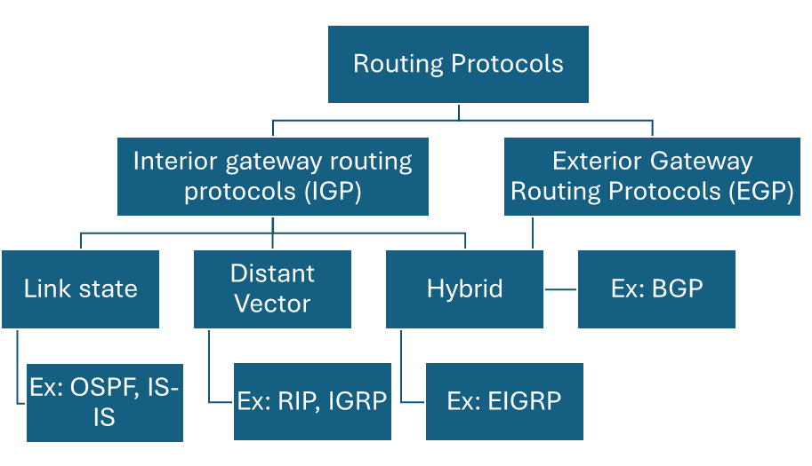

# Dynamic Routing

- Dynamic routing is when protocols are used to find networks and update routing tables on routers. True, this is easier than using static or default routing, but it'll cost you in terms of router CPU processes and bandwidth on the network links.
- Functions of routing protocols:
  - Dynamically share information between routers.
  - Automatically update routing table when topology changes.
  - Determine best path to a destination

# Routed vs routing protocol

- Routed protocols are the ones which are used for data transfer.
- Routed protocols are used by the Routers, Hosts, Servers and APs.
- Examples: IPv4, IPv6, IPC, Apple Talk
- Routing protocols, on the other hand, are used by routers to propagate the routing information to other routers.
- Examples: RIP, EIGRP, OSPF

# Components of routing protocols

- Algorithm
  - In the case of a routing protocol, algorithms are used for facilitating routing information and best path determination
- Routing protocol messages - These are messages for discovering neighbors and exchange of routing information.
  

# IGP and EGP

- The IGP Protocols are used in the private or internal internetworks of an organization.
- But the EGP protocols are used on the external WAN (or ISP) internetworks.

# IGP

## a. Distance Vector Protocol

- The find the best path to remove network by judging distance
- Each time a packet goes through Router, its called a HOP
- The route with the less number of HOP is called to be the best path.
- They send the entire routing table to the directly connected neighbors (called routing by Rumor).
- Both RIP and IGRP are distance vector protocols.

## b. Link-state routing protocols

- Also called shortest-path-first (SPF), in which the Router create three separate tables:
  - One keeps track of directly connected neighbors (neighbor table)
  - One determines the topology of the entire internetwork (topology table)
  - One is used as the routing table (routing table)
- Link state sends updates containing the state of their own link to call the routers in the internetwork.
- And it make decision based on cost (bandwidth or speed of the network)
- OSPF is pure link state protocol

## c. Hybrid routing protocols

- Hybrid uses the aspects of both link state and distance vector
- EIGRP is an example for hybrid protocol.

## Comparison of DV and LS

- Distance vector
  - Incomplete view of network topology.
  - Generally, periodic updates.
  - EX: IGRP, RIPv1 and RIPv2
- Link state
  - Complete view of network topology is created.
  - Updates are not periodic.
  - Ex: OSPF and IS-IS

# Classful and Classless routing protocols

- The IGP can also be classified into two categories ad follows:
- Classful routing protocols
  - All networks have the same subnet mask,
  - Does not send Subnet mask with routing protocol updates
  - Ex: RIPv1 and IGRP
- Classless routing protocols
  - All networks can have different subnet masks
  - Send Subnet mask with routing protocol updates
  - Ex: RIPv2, EIGRP, OSPF, IS-

# Metric

- A value used by a routing protocol to determine which routes are better than others
- its a calculated value used to determine the best path to destination.
- Metric used for each routing protocol
  - RIP: hop count
  - IGRP and EIGRP: Bandwidth (used by default), Delay (used by default), Load and Reliability.
  - OSPF: Cost, Bandwidth (Cisco's implementation)

# Administrative Distance (AD) value

- AD shows the trustworthiness of the routing information.
- AD is an 80bits value between 0 and 255, the lower the value the trustworthy the routing information.

| Route Source                   | Default AD                          |
| ------------------------------ | ----------------------------------- |
| Connected interface            | 0                                   |
| Static route                   | 1                                   |
| Internal EIGRP, External EIGRP | 90, 170                             |
| IGRP                           | 100                                 |
| OSPF                           | 110                                 |
| RIP                            | 120                                 |
| Unknown                        | 255 (this route will never be used) |
