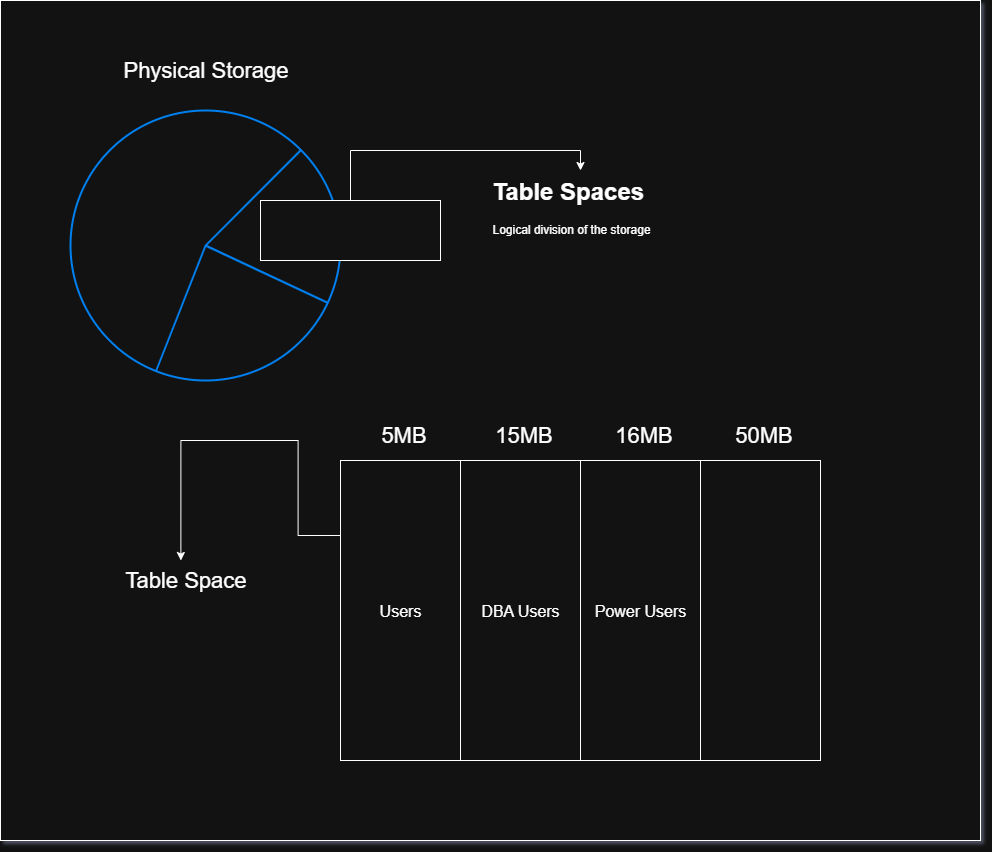

# Database Administration

## Definition

**Database Administration (DBA)** is the process of managing, maintaining, securing, monitoring, backing up, and recovering a database system.

In simple words:

> **Database administration means keeping a database secure, available, efficient, and reliable.**

A Database Administrator (DBA) is responsible for making sure that authorized users can access the required data while preventing unauthorized access or data loss.

### Main Objective

If you are responsible for maintaining a database, your main responsibilities are:

- Keep the database available.
- Protect data from unauthorized access.
- Manage database users and permissions.
- Monitor database performance.
- Manage storage.
- Perform backups.
- Recover data after failures.
- Maintain and optimize the database.

---

## Key Points

### Database Management Software

Common enterprise database management systems include:

| DBMS                | Organization |
| ------------------- | ------------ |
| **Oracle Database** | Oracle       |
| **SQL Server**      | Microsoft    |
| **Db2**             | IBM          |

Your course primarily focuses on **Oracle Database**.

> **Correction:** Oracle should not be described as supporting exactly 5,000 users. The number of concurrent users depends on the database architecture, hardware, licensing, workload, configuration, and application design. Oracle can support far more than 5,000 users in appropriate environments.

---

# Oracle Database History

Oracle has gone through several major naming generations.

### Oracle 6i, 8i, 9i

The **`i`** stood for **Internet**.

Oracle used the `i` branding to emphasize Internet-related database technologies and application development.

Examples:

- Oracle 8i
- Oracle 9i

### Oracle 10g and 11g

The **`g`** stood for **Grid**.

Oracle's Grid Computing concept focused on using collections of computing resources together to provide scalability, availability, and efficient resource utilization.

Examples:

- Oracle 10g
- Oracle 11g

### Oracle 12c

The **`c`** stood for **Cloud**.

Oracle 12c introduced Oracle's **multitenant architecture**, which allowed multiple pluggable databases (PDBs) to operate within a container database (CDB).

### Oracle Database 23ai and 26ai

Oracle subsequently introduced the **AI-oriented naming** used in newer releases.

> **Important correction:** `26ai` does **not** simply mean that the database is a server where users randomly connect to different servers. Also, the transition from 12c to newer releases involves many architectural and feature changes beyond the naming.

For exam purposes, remember:

```text
i → Internet
g → Grid
c → Cloud
ai → Artificial Intelligence
```

---

# What Is a Database?

## Definition

A **database** is an organized collection of data that can be stored, accessed, managed, and updated efficiently.

A **Database Management System (DBMS)** is software used to create, manage, and interact with databases.

Examples:

- Oracle Database
- Microsoft SQL Server
- IBM Db2
- PostgreSQL
- MySQL

### Example

A university database might contain:

```text
Students
Courses
Teachers
Departments
Grades
Attendance
```

A student record could contain:

```text
Student ID: 1025
Name: Ahmad
Department: Computer Science
Semester: 3
```

---

# Types of Data

Data can be broadly categorized according to how organized its structure is.

## 1. Structured Data

Data that follows a predefined structure or schema.

Examples:

- Relational database tables
- SQL tables
- Excel spreadsheets

Example:

|  ID | Name  | Age |
| --: | ----- | --: |
| 101 | Ahmad |  20 |
| 102 | Ali   |  21 |

---

## 2. Semi-Structured Data

Data that does not follow a strict tabular structure but contains organizational information such as keys, tags, or metadata.

Examples:

- JSON
- XML

Example:

```json
{
  "id": 101,
  "name": "Ahmad",
  "age": 20
}
```

> **Correction:** MongoDB itself is a **database management system**, not a type of data. MongoDB commonly stores documents using BSON, which is a semi-structured/document-oriented data representation.

---

## 3. Unstructured Data

Data without a predefined tabular structure.

Examples:

- Images
- Videos
- Audio
- PDF documents
- Text documents

---

# Database Users

## Definition

**Database users** are people or applications that interact with a database to store, retrieve, modify, or manage data.

The type of database user depends on their responsibilities and level of access.

A small organization may have only one DBA, while a large organization may have several DBAs specializing in different areas.

---

# Types of Users in Oracle

## 1. Database Administrator (DBA)

A **Database Administrator** is responsible for managing and maintaining the database system.

A database system requires appropriate administrative responsibility, although a large organization may divide DBA responsibilities among multiple people.

### DBA Responsibilities

A DBA may be responsible for:

- Installing Oracle Database.
- Upgrading Oracle Database.
- Managing database storage.
- Planning future storage requirements.
- Creating and managing tablespaces.
- Creating database objects.
- Managing users.
- Managing security.
- Controlling user access.
- Monitoring database performance.
- Optimizing database performance.
- Planning backups.
- Performing database backups.
- Recovering databases after failures.
- Maintaining archived data.
- Monitoring database availability.
- Troubleshooting database problems.
- Working with Oracle technical support when necessary.
- Ensuring compliance with applicable Oracle licensing agreements.

---

# 2. Power Users

A **power user** is an advanced database user who has more privileges than an ordinary user but does not necessarily have complete administrative authority.

For example, a power user might be allowed to:

- Run complex queries.
- Generate reports.
- Access several tables.
- Modify certain data.
- Perform specialized database tasks.

The exact privileges depend on the organization's security design.

---

# 3. Normal Users

Normal users interact with the database according to the permissions assigned to them.

For example:

A student might be allowed to:

```text
View → Grades
View → Courses
View → Attendance
```

but not:

```text
Delete → Students
Modify → Grades
Create → Users
```

This is an example of **role-based access control and privilege management**.

---

# Database Security

One of the most important DBA responsibilities is controlling who can access what.

A database should follow the **principle of least privilege**:

> Give users only the permissions they actually need.

For example:

```text
Student
   ↓
Can view own grades

Teacher
   ↓
Can enter and update grades

DBA
   ↓
Can administer database
```

This reduces the possibility of accidental or unauthorized changes.

---

# Oracle Storage Management

When Oracle Database stores data, it uses several logical and physical storage concepts.

A simplified hierarchy is:

```text
Database
   ↓
Tablespaces
   ↓
Segments
   ↓
Extents
   ↓
Data Blocks
```

---

# Tablespace

## Definition

A **tablespace** is a logical storage container within an Oracle database.

It provides a way to organize and manage database storage.

For example:

```text
Database
│
├── USERS tablespace
├── SYSTEM tablespace
├── SYSAUX tablespace
└── TEMP tablespace
```

A tablespace is associated with one or more **datafiles**, which are physical files on storage.

### Important distinction

Your original notes say:

> Oracle software divides the hard-drive space into tablespaces.

This is an oversimplification.

A better understanding is:

```text
Physical Storage
      ↓
Datafiles
      ↓
Tablespaces
      ↓
Database Objects
      ↓
Tables / Indexes / etc.
```

**Tablespace = logical storage structure**

**Datafile = physical file used to store database data**



---

# Example / Code

## Connecting to Oracle

A common command-line Oracle client is:

```bash
sqlplus
```

You can use SQL*Plus to connect to an Oracle Database and execute SQL or SQL*Plus commands.

For example:

```sql
sqlplus username/password
```

Or, depending on the environment:

```sql
sqlplus username/password@service_name
```

> In real systems, avoid exposing passwords directly in command history or scripts when possible.

---

# Indexes

## Definition

An **index** is a database object that helps Oracle locate rows efficiently without having to examine every row of a table.

Think of an index like the index at the back of a textbook.

Instead of reading the entire book to find a topic:

```text
Search every page
      ↓
Slow
```

the book's index tells you where to go:

```text
Topic → Page Number
```

Similarly, a database index helps Oracle locate relevant table rows.

---

## Example

Suppose we have:

```text
STUDENTS
--------------------------------
ID      NAME       DEPARTMENT
--------------------------------
101     Ahmad      CS
102     Ali        IT
103     Hamid      CS
104     Omar       SE
```

If we frequently search:

```sql
SELECT *
FROM students
WHERE id = 103;
```

an index on `ID` may allow Oracle to find the relevant row much more efficiently than scanning the entire table.

An index could be created with:

```sql
CREATE INDEX idx_students_id
ON students(id);
```

---

# Explanation

Your original explanation compares a database index to a **hashtable**. That comparison is useful for intuition, but it is technically inaccurate as a general description of Oracle indexes.

Oracle supports different index structures, and the common default is a **B-tree index**.

Conceptually:

```text
Query
  ↓
WHERE ID = 103
  ↓
Index
  ↓
Find matching row location
  ↓
Table
  ↓
Return data
```

An index can significantly improve read performance, but indexes also have costs:

- They require storage.
- They must be maintained when table data changes.
- Too many indexes can slow down `INSERT`, `UPDATE`, and `DELETE` operations.

Therefore, DBAs and developers should create indexes based on actual query and workload requirements.

---

# Common Mistakes

### 1. Confusing DBMS with database

**Incorrect:**

> Oracle is a database.

**Better:**

> Oracle Database is a database management system that stores and manages databases.

---

### 2. Saying MongoDB is a type of data

**Incorrect:**

> MongoDB is semi-structured data.

**Correct:**

> MongoDB is a document-oriented database management system that commonly stores semi-structured BSON documents.

---

### 3. Assuming `10g` means multiple servers automatically share connections

The **Grid** concept is about coordinated computing resources and scalability. It does not simply mean that a second server automatically receives the 501st connection.

---

### 4. Confusing tablespaces and datafiles

Remember:

```text
Tablespace → Logical
Datafile   → Physical
```

---

### 5. Assuming indexes are always good

Indexes can improve query performance, but they also consume storage and increase the work required for data modifications.

---

### 6. Giving every user administrative privileges

Users should receive only the privileges required for their responsibilities.

---

# Short Exam Notes

- **Database:** Organized collection of data.
- **DBMS:** Software used to manage databases.
- **DBA:** Person responsible for database administration and maintenance.
- **Main DBA tasks:** Security, users, storage, backup, recovery, monitoring, and performance optimization.
- **Structured data:** Data with a predefined schema, e.g. relational tables.
- **Semi-structured data:** Data with flexible structure, e.g. JSON/XML.
- **Unstructured data:** Data without a predefined tabular structure, e.g. images and videos.
- **Tablespace:** Logical storage container in Oracle.
- **Datafile:** Physical file associated with a tablespace.
- **Index:** Database object used to speed up data retrieval.
- **Principle of least privilege:** Users should receive only the permissions they need.
- **Oracle naming:** `i = Internet`, `g = Grid`, `c = Cloud`, `ai = Artificial Intelligence`.
- **SQL\*Plus:** Command-line interface for interacting with Oracle Database.
- **Important:** Indexes improve some queries but add storage and maintenance overhead.
