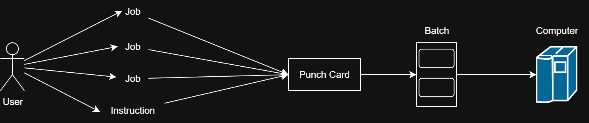
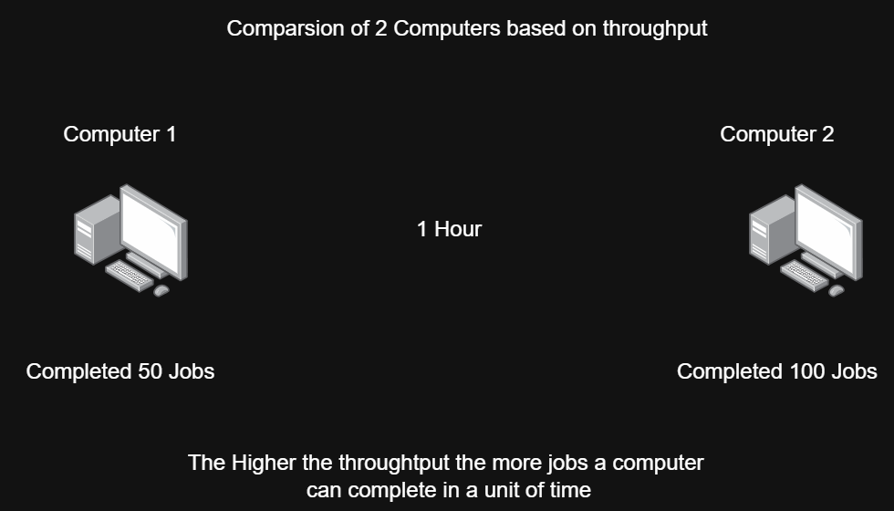
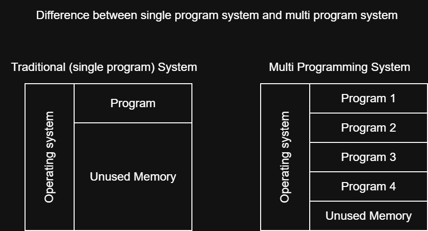
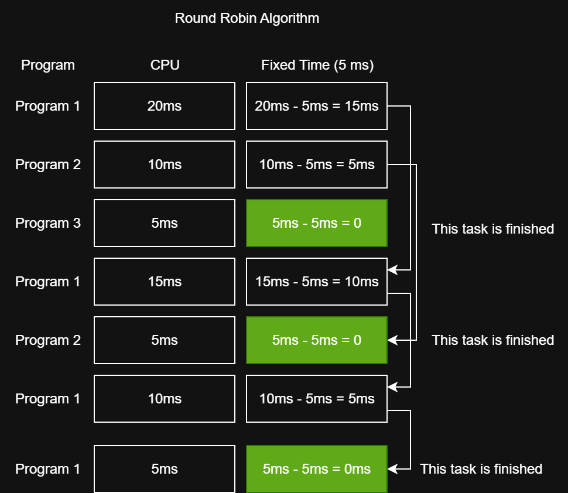
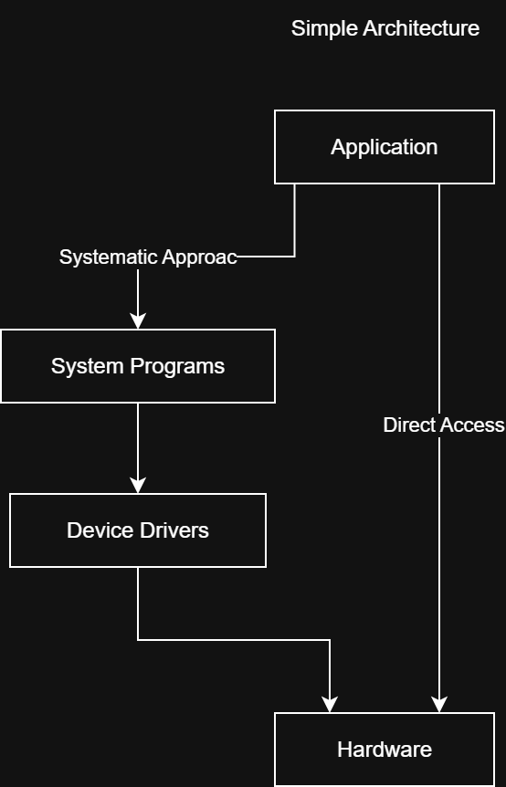
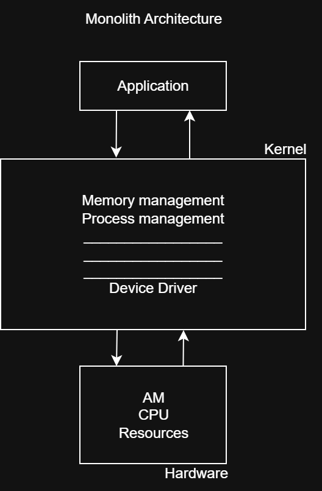
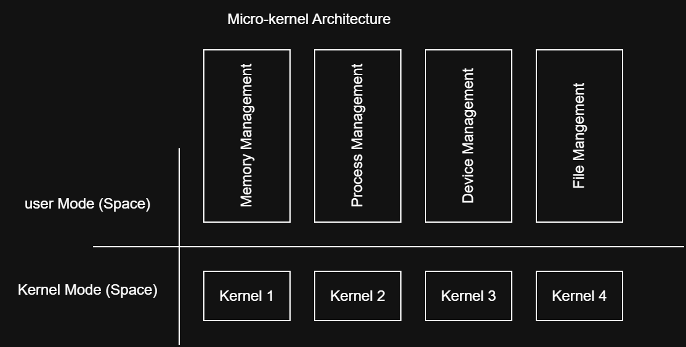

# Operating System Types and Structures / Architectures

## Definition

An **Operating System (OS)** is system software that provides an interface between **user application programs and computer hardware**. Because an operating system is complex, its architecture defines how its components are organized and how they communicate with each other.

---

## Key Points

### 1. Batch Processing Systems

- Popular during the **1940s–1950s**.
- Users did **not interact directly** with the computer.
- Users prepared jobs using offline devices such as **punch cards**.
- Jobs were submitted to a **computer operator**.
- The operator grouped similar jobs into **batches** and submitted them for processing.
- CPU utilization was generally **low**.
- It was difficult to prioritize one job over another.

### Basic Flow

**User → Computer Operator → Batch of Jobs → Computer → Processing**

> **Batch** means a group of jobs collected together for processing.



---

### 2. Multiprogramming Systems

- Emerged during the **1950s–1960s**.
- Multiple programs could be loaded into **main memory (RAM)** simultaneously.
- Each program was given its own memory space.
- If one program was waiting for an **I/O operation**, the CPU could work on another program.
- This reduced CPU idle time.
- Improved:
  - **CPU utilization**
  - **System efficiency**
  - **Throughput**

- Multiprogramming became a foundation for modern multitasking operating systems.

### Important Term: Throughput

**Throughput** = the number of jobs completed per unit of time.

Example:

If a system completes **50 jobs in 1 hour**:

$$
Throughput = 50\ jobs/hour
$$



### Important Correction: Context Switch

A **context switch** is not a device that moves programs between RAM and CPU.

It is the process of **saving the state of one running process and loading the saved state of another process**, allowing the CPU to switch between processes.



---

### 3. Time-Sharing Systems

- Developed and widely used during the **1960s–1970s**.
- Time-sharing is a **logical extension of multiprogramming**.
- Multiple users/processes can interact with the computer.
- CPU time is divided into small units called:
  - **Time slice**
  - **Time quantum**

- The OS rapidly switches the CPU between processes/users.
- Provides an **interactive computing environment**.
- Gives users the impression that they have their own dedicated computer.
- Improves CPU utilization and provides quick response times.
- Examples mentioned in the slides:
  - **UNIX**
  - **Linux**

### Round Robin

A common scheduling approach associated with time-sharing is **Round Robin**.

Each process receives a fixed amount of CPU time.

Example:

```text
Process A → 100 ms
Process B → 100 ms
Process C → 100 ms
Process A → 100 ms
Process B → 100 ms
...
```

If a process does not finish during its time slice, it waits for another turn.

**Important:** Round Robin is a **CPU scheduling algorithm**, while time-sharing is an **operating-system approach/concept**.



---

### 4. GUI-Based Systems

- Became popular during the **1970s–1980s**.
- Provide a **Graphical User Interface (GUI)**.
- Users interact through:
  - Windows
  - Icons
  - Menus
  - Buttons

- Reduce the need to memorize complex commands.
- Make computers easier for beginners to use.
- Commonly use pointing devices such as a **mouse or touchpad**.
- Support multitasking through multiple windows and applications.
- **Microsoft Windows** is a major example.

---

### 5. Networked Systems

- Became widely popular during the **1980s–1990s**.
- A **Network Operating System (NOS)** can run on a server and manage network resources.
- Supports management of:
  - Users
  - Groups
  - Files
  - Applications
  - Security

- Allows multiple computers to share resources.
- Can provide:
  - Shared file access
  - Shared printers
  - Communication between computers

- Supports networks such as **LAN** and other network environments.
- Provides centralized administration and network management.

---

### 6. Mobile Operating Systems

- Earlier mobile systems included **Symbian OS** and **Java ME**.
- They primarily supported basic functions such as calling, messaging, and simple applications.
- The development of smartphones created demand for more advanced operating systems.
- Modern mobile operating systems support:
  - Multitasking
  - Internet access
  - Multimedia
  - Touchscreens
  - Mobile applications

- Major modern examples include:
  - **Android**
  - **iOS**

---

### 7. AI-Powered Operating Systems

Since the **2010s**, AI technologies have increasingly been integrated into modern operating systems.

AI can help systems:

- Understand user commands.
- Recognize speech.
- Process natural-language commands.
- Automate tasks.
- Analyze user preferences.
- Provide personalized recommendations.
- Improve productivity and accessibility.

Examples mentioned in the slides include:

- **Siri**
- **Google Assistant**
- **Amazon Alexa**

---

# Operating System Structures / Architectures

## Definition

**OS architecture** describes how the components of an operating system are organized and how they communicate with applications and hardware.

The slides identify five popular architectures:

1. **Simple Architecture**
2. **Monolithic Architecture**
3. **Microkernel Architecture**
4. **Layered Architecture**
5. **Modular Architecture**

---

## 1. Simple Architecture

### Key Points

- Simple operating systems have a relatively uncomplicated structure.
- They often started as small systems and later expanded beyond their original design.
- **MS-DOS** is the example given in the slides.
- The architecture has relatively few interfaces and layers.
- Components can be closely connected.

### Advantages

- **Easy development**
- **Good performance**

Because there are fewer layers and less overhead, interaction with hardware can be relatively direct.

### Disadvantages

- **Frequent system failures**
- **Poor maintainability**

Because components are tightly coupled, a failure or modification in one part can affect other parts.

### Example

```text
Application
     ↓
System Programs
     ↓
Hardware
```

The exact internal structure of MS-DOS is more complicated than this simplified representation, so this diagram should be understood as a **basic conceptual model**, not an exact architecture diagram.



---

## 2. Monolithic Architecture

### Definition

In a **monolithic architecture**, a central kernel is responsible for most major operating-system operations.

These can include:

- File management
- Memory management
- Device management
- Other OS services

The kernel has access to system resources and acts as an interface between applications/system programs and hardware.

### Advantages

- Relatively straightforward design because major functionality is concentrated in the kernel.
- Good performance because OS services can communicate efficiently within the kernel.

### Disadvantages

- A serious kernel failure can affect the entire operating system.
- Adding or changing services can be difficult because components are closely connected.

### Basic Structure

```text
Applications
     ↓
   Kernel
     ↓
  Hardware
```



---

## 3. Microkernel Architecture

### Definition

A **microkernel** architecture keeps the kernel as small as possible and moves many operating-system services outside the kernel.

The slide describes the approach as dividing functionality into separate components/services, with the goal of improving stability and maintainability.

### Important Correction to Your Notes

Your note says:

> "In micro-kernel, we have multiple kernels."

This is **not technically correct**.

A microkernel system does **not** normally mean that there are multiple kernels.

Instead:

- There is **one small microkernel**.
- Many OS services can run separately, often as user-space processes/servers.
- These services communicate with each other and with the microkernel.

A simplified model is:

```text
Applications
     ↓
OS Services
(File, Network, Drivers, etc.)
     ↓
Microkernel
     ↓
Hardware
```

### IPC

**IPC = Inter-Process Communication**

IPC allows separate processes to **communicate and exchange information**.

In microkernel systems, IPC is particularly important because many services are separated into different processes. Communication between these components can involve **message passing**.

### Advantages

- **Reliability and stability**
- **Maintainability**
- Smaller components are easier to manage independently.

### Disadvantages

- **More complex to design**
- Communication between separate components can introduce additional overhead and potentially reduce performance compared with some monolithic designs.



---

## Common Mistakes

1. **Multiprogramming ≠ multitasking**
   - Multiprogramming keeps multiple programs in memory and switches when one waits.
   - Modern multitasking builds on these ideas and emphasizes responsive execution.

2. **Context switch ≠ moving a program from RAM to CPU**
   - A context switch saves one process's CPU state and restores another's state.

3. **Throughput ≠ execution time**
   - Throughput measures how many jobs are completed per unit of time.

4. **Time-sharing ≠ Round Robin**
   - Time-sharing is the overall concept.
   - Round Robin is a scheduling algorithm commonly used to implement time-sharing.

5. **Microkernel ≠ multiple kernels**
   - A microkernel is generally **one small kernel** with many services separated from it.

6. **GUI is not itself a complete OS architecture**
   - GUI describes how users interact with the system.
   - An OS can have a GUI while internally using a particular kernel architecture.

7. **Batch processing does not mean one punch card**
   - A batch is a **group of jobs/instructions** collected for processing.

---

## Short Exam Notes

### OS Types

| Type                 | Main Idea                         | Key Point                           |
| -------------------- | --------------------------------- | ----------------------------------- |
| **Batch**            | Jobs processed in groups          | No direct user interaction          |
| **Multiprogramming** | Multiple programs in memory       | Reduces CPU idle time               |
| **Time-Sharing**     | CPU divided among users/processes | Uses time slices                    |
| **GUI-Based**        | Graphical interaction             | Windows, icons, menus               |
| **Networked**        | Network resource management       | File/printer/resource sharing       |
| **Mobile**           | Designed for mobile devices       | Android, iOS                        |
| **AI-Powered**       | AI integrated into OS features    | Speech, automation, personalization |

### OS Architectures

| Architecture    | Main Idea                                        |
| --------------- | ------------------------------------------------ |
| **Simple**      | Small/simple structure; often tightly coupled    |
| **Monolithic**  | Most major OS services operate within the kernel |
| **Microkernel** | Small kernel + separate OS services              |

### Most Important Terms

- **Batch:** Group of jobs processed together.
- **Multiprogramming:** Multiple programs kept in memory to improve CPU utilization.
- **Throughput:** Jobs completed per unit of time.
- **Time Slice / Time Quantum:** Small amount of CPU time allocated to a process.
- **Round Robin:** CPU scheduling algorithm that gives processes turns using time slices.
- **Context Switch:** Switching the CPU from one process to another by saving/restoring process state.
- **IPC:** Inter-Process Communication; allows processes to communicate.
- **Kernel:** Core component of an operating system responsible for critical system functions.

**Exam focus:** Be especially prepared to compare **Batch vs. Multiprogramming vs. Time-Sharing**, and **Monolithic vs. Microkernel**.
