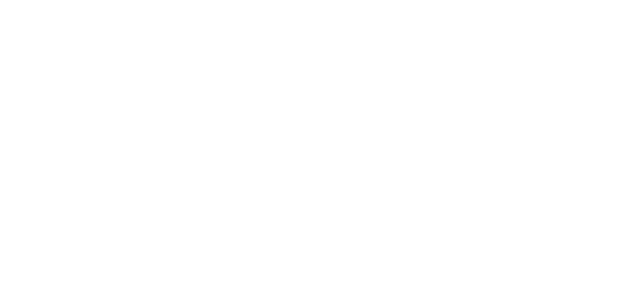
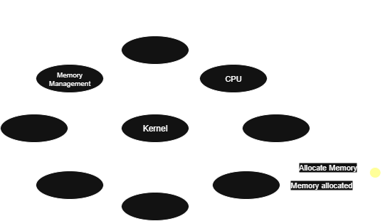
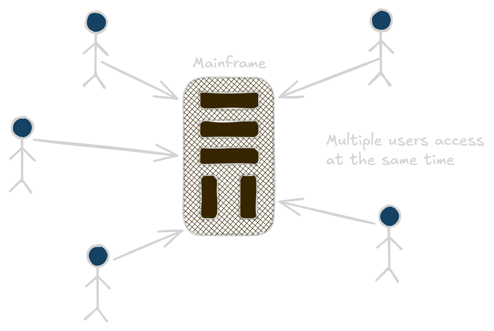
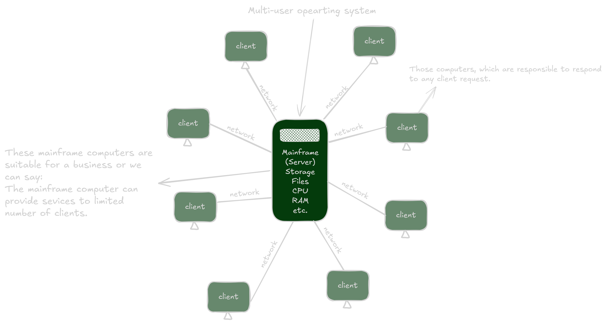
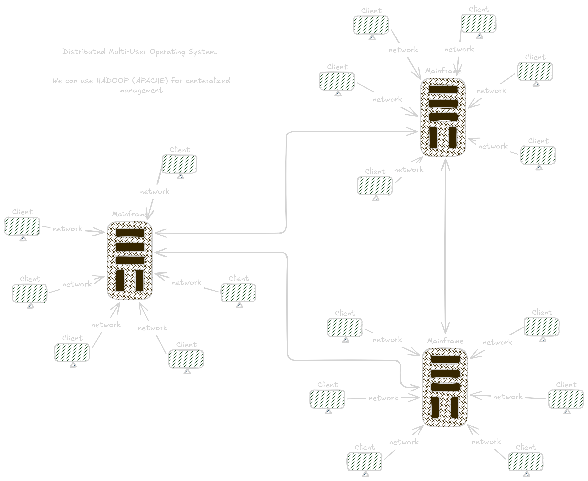

# Operating System Architecture and Types of Operating Systems

## Definition

Operating system architecture describes how the components of an operating system are organized and how they interact with each other.

The main architectures discussed here are:

1. **Layered Architecture**
2. **Modular Architecture**

Operating systems can also be classified according to how users and processors access system resources:

1. **Single-User Operating System**
2. **Multi-User Operating System**
   - Distributed System
   - Time-Sliced System
   - Multiprocessor System

---

## Key Points

### 1. Layered Architecture

Layered architecture organizes the operating system into multiple layers.

- **Bottom layer:** Hardware
- **Top layer:** User interface / applications
- Each layer **provides services to the layer above it**.
- Each layer **relies on the layer below it**.
- Windows XP and Windows 7 are examples of operating systems using a modular layered approach.
- It improves:
  - Portability
  - Stability
  - Security
  - Maintainability

### Advantages

- **Highly customizable:** A layer can be modified or extended without necessarily changing unrelated layers.
- **Verifiable:** Each layer can be tested, debugged, and verified separately.

### Disadvantage

- **Complex design:** Layers must be carefully designed because each layer generally communicates with the appropriate lower-level layers.



---

### 2. Modular Architecture

Modular architecture follows principles similar to a monolithic architecture but provides a more flexible design.

- A **central kernel** is responsible for major operating-system operations.
- The kernel contains core functionality.
- Additional services are implemented as **modules**.
- Modules can be loaded:
  - During system boot (**boot time**)
  - While the system is running (**runtime**)

- **Sun Solaris** is an example associated with modular operating-system architecture.

**Main idea:**

> **Kernel + Dynamically Loadable Modules = Modular Architecture**



---

# Single-User Operating System (SUS)

## Definition

A **Single-User Operating System** is designed for **one user to actively use the system at a time**.

The system's resources, such as CPU, memory, storage, and I/O devices, are primarily available to that user.

> Single-user does **not** mean single-tasking.

A single user can run multiple applications at the same time.

---

## Key Points

- Only one user uses the system at a time.
- Resources are primarily dedicated to that user.
- Supports **multitasking**.
- Has a simpler design compared with a multi-user system.
- Requires fewer user-access and permission mechanisms.
- Generally provides a user-friendly environment.
- Commonly associated with personal computers and laptops.
- Suitable for individual productivity tasks.

### Benefits

- Simple to use and manage
- Quick response time
- Lower system complexity
- Easy installation and maintenance
- Cost-effective for personal use
- Good performance for individual users

### Limitations

- Does not support simultaneous users.
- Limited scalability for large organizations.
- Limited resource sharing between users.
- Less suitable for large shared environments.
- Limited centralized management.
- Not ideal for enterprise systems requiring many simultaneous users.

---

## Example / Code

Examples of systems commonly used in a single-user/personal-computing context include:

- Windows on a personal computer
- macOS on a personal computer

> **Important:** Modern operating systems such as Windows and macOS can have multiple user accounts, but ordinary desktop use is generally centered around one active interactive user session at a time. Therefore, the simple classroom definition of "single-user" should not be confused with "only one user account exists."

---

## Explanation

Suppose you are using a personal computer:

```text
User
  ↓
Operating System
  ↓
CPU + RAM + Storage + I/O
```

The operating system manages these resources primarily for that user's applications.

For example, you can simultaneously:

- Browse the web
- Play music
- Edit a document
- Run a code editor

This is **multitasking**, even though there is only one active user.

---

## Output (if any)

No program output.

---

## Common Mistakes

- ❌ **Single-user means single-tasking.**
  ✅ A single-user OS can support multitasking.

- ❌ **A single-user OS cannot connect to a network.**
  ✅ It can connect to networks and use network services.

- ❌ **Single-user means the computer has only one user account.**
  ✅ The concept primarily concerns simultaneous/active use, not necessarily the number of accounts.


---

# Multi-User Operating System

## Definition

A **Multi-User Operating System** allows **multiple users to access and use computer resources concurrently**.

The operating system manages resources and permissions so that users can work without interfering with one another.

---

## Key Points

- Multiple users can access system resources.
- CPU, memory, storage, and I/O resources are **shared**.
- Users can have different permissions.
- Provides user authentication and access control.
- Supports multiple users and processes.
- Provides better resource sharing.
- Common in servers, mainframes, and large computing environments.

A typical simplified model is:

```text
Client 1 ─┐
Client 2 ─┼──→ Server / Main Computer
Client 3 ─┘
```



The server provides services and resources to connected clients.

> **Correction:** A multi-user OS does **not necessarily require the Internet**. Multiple users can access a system through a local network or directly through terminals, depending on the system.

---

## Types of Multi-User Operating Systems

There are three major types in these notes:

1. **Distributed System**
2. **Time-Sliced System**
3. **Multiprocessor System**



---

# 1. Distributed System

## Definition

A **Distributed Operating System** manages multiple separate computers connected through a network and attempts to provide users with a **unified system or service**.

The machines cooperate and share processing, storage, or other resources.



---

## Key Points

- Uses multiple network-connected computers.
- Computers cooperate to perform tasks.
- Resources can be distributed across machines.
- Provides scalability.
- Can improve reliability and fault tolerance.
- Attempts to provide a unified experience.

### Scalability

**Scalability** means the ability to increase system capacity by adding additional computing resources.

For example:

```text
Before:
Computer A + Computer B

After:
Computer A + Computer B + Computer C + Computer D
```

Adding machines can increase the system's capacity.

---

## Example / Code

**Apache Hadoop** is an example of distributed computing technology used to process and store large datasets across clusters of computers.

Other real-world applications of distributed computing include:

- Electronic banking systems
- Large-scale social-media applications
- Cloud computing platforms

> **Important correction:** Hadoop is better described as a **distributed data-processing/storage framework**, not a complete general-purpose distributed operating system.

---

## Explanation

Instead of depending on one computer:

```text
          Network
       /     |      \
   PC A    PC B    PC C
       \     |      /
        Distributed
          System
```

Multiple computers cooperate to provide services.

If one machine becomes unavailable, some distributed systems can continue operating using other machines, depending on their design and redundancy.

---

## Output (if any)

No program output.

---

## Common Mistakes

- ❌ Distributed system means all computers are physically inside one machine.
  ✅ They are separate computers connected through a network.

- ❌ Hadoop is exactly the same as a distributed operating system.
  ✅ Hadoop is primarily a distributed storage and data-processing framework.

- ❌ Distributed systems always guarantee that failure of one computer has no effect.
  ✅ Reliability depends on redundancy and system design.

---

# 2. Time-Sliced System

## Definition

A **Time-Sliced System**, also called a **Time-Sharing System**, divides CPU time into small units called **time slices** or **time quanta**.

Each process receives a limited amount of CPU time before the CPU is assigned to another process.

---

## Key Points

- CPU time is divided into small intervals.
- Each process receives a time slice.
- After its time slice expires, another process can run.
- Allows many processes/users to share the CPU.
- Improves responsiveness and fairness.

Example:

```text
CPU Time:

| P1 | P2 | P3 | P1 | P2 | P3 |
```

If each process receives 10 ms:

```text
P1 → 10 ms
P2 → 10 ms
P3 → 10 ms
P1 → 10 ms
...
```

The rapid switching makes the system appear to run many processes simultaneously.

---

## Example / Code

A simple conceptual example:

```text
Process     Time Slice
P1          10 ms
P2          10 ms
P3          10 ms
```

The CPU repeatedly gives each process its allocated time.

---

## Explanation

A CPU cannot necessarily execute every process at exactly the same instant on a single processor.

Instead, the operating system performs **context switching**:

```text
P1 → P2 → P3 → P1 → P2 → P3
```

Because switching happens very quickly, users experience the system as responsive and interactive.

---

## Output (if any)

No program output.

---

## Common Mistakes

- ❌ Time slice and process are the same thing.
  ✅ A time slice is a limited amount of CPU time allocated to a process.

- ❌ Time-sharing means every process runs for unlimited time.
  ✅ Each process receives a limited CPU interval.

- ❌ Time-sharing requires multiple CPUs.
  ✅ A single CPU can use time-sharing.

---

# 3. Multiprocessor System

## Definition

A **Multiprocessor System** is a computer system containing **two or more processors/CPU cores** that can work together to execute tasks.

Processors may share resources such as:

- Main memory
- System buses
- I/O devices

This enables **parallel processing**.

---

## Key Points

### Advantages

- **Increased performance:** Multiple processors can execute tasks in parallel.
- **Better resource utilization:** Work can be distributed among processors.
- **Higher reliability:** Some systems can continue operating if one processor fails, depending on the architecture.

### Types

There are two primary types covered in the teacher's slides:

1. **Symmetric Multiprocessing (SMP)**
2. **Asymmetric Multiprocessing (AMP)**

The notes also mention **massively parallel processors**, which is a broader concept rather than one of the two primary types listed in the slide.

---

# Symmetric Multiprocessing (SMP)

## Definition

In **Symmetric Multiprocessing**, all processors have equal status and can execute operating-system and application tasks.

```text
       Operating System
        /      |      \
      CPU 1   CPU 2   CPU 3
        \      |      /
          Shared Memory
```

---

## Key Points

- All processors work equally.
- Processors share memory/resources.
- There is no single master processor controlling all work.
- Tasks can be distributed among processors.

---

# Asymmetric Multiprocessing (AMP)

## Definition

In **Asymmetric Multiprocessing**, one processor acts as the **master**, while other processors perform tasks assigned to them.

```text
          Master CPU
         /    |     \
      CPU 2  CPU 3  CPU 4
```

---

## Key Points

- One processor has a controlling/master role.
- Other processors perform assigned tasks.
- Work is managed by the master processor.
- This differs from SMP, where processors have equal roles.

---

# Massively Parallel Processing

## Definition

**Massively Parallel Processing (MPP)** uses a very large number of processors or processing units to perform computations in parallel.

The exact number is system-dependent; it is not simply defined as "100/1000+ CPUs."

---

## Example / Code

Conceptually:

```text
Task
 ↓
 ┌────┬────┬────┬────┐
CPU 1 CPU 2 CPU 3 CPU 4
 └────┴────┴────┴────┘
        ↓
   Parallel Work
```

Instead of one processor doing all the work sequentially, many processors work on different portions of a problem.

---

## Explanation

Consider four independent tasks:

```text
Single Processor:

Task 1 → Task 2 → Task 3 → Task 4
```

With multiple processors:

```text
CPU 1 → Task 1
CPU 2 → Task 2
CPU 3 → Task 3
CPU 4 → Task 4
```

The tasks can potentially finish faster because they are processed in parallel.

---

## Output (if any)

No program output.

---

## Common Mistakes

- ❌ Multiprocessor means multiple users.
  ✅ Multiprocessor means multiple processors.

- ❌ SMP has one master processor.
  ✅ SMP processors have equal status.

- ❌ AMP processors are all equal.
  ✅ AMP has a master processor and assigned processors.

- ❌ More processors always make every program proportionally faster.
  ✅ Speedup depends on whether the workload can be parallelized and on system overhead.

---

# Scheduling Algorithms Mentioned in the Notes

## First Come, First Served (FCFS)

### Definition

**First Come, First Served (FCFS)** executes processes in the order in which they arrive.

```text
Arrival:
P1 → P2 → P3

Execution:
P1 → P2 → P3
```

If `P1` requires a long time, `P2` and `P3` must wait.

### Common Mistake

The statement **"there is no wait time"** is incorrect.

FCFS can produce **significant waiting time**, especially when a long process arrives before shorter processes.

---

## Shortest Job First (SJF)

### Definition

**Shortest Job First (SJF)** selects the process with the smallest CPU burst time first.

For example:

```text
P1 = 8 ms
P2 = 3 ms
P3 = 5 ms
```

Execution order:

```text
P2 → P3 → P1
```

### Important Point

SJF **does not eliminate waiting time**.

It generally minimizes **average waiting time** when the required CPU burst times are known accurately, but longer processes may experience starvation if shorter jobs continually arrive.

---

## Explanation

Compare:

```text
FCFS:
P1 (8) → P2 (3) → P3 (5)
```

versus:

```text
SJF:
P2 (3) → P3 (5) → P1 (8)
```

SJF allows shorter jobs to finish earlier, while FCFS strictly follows arrival order.

---

# Short Exam Notes

### Layered Architecture

- Bottom = **Hardware**
- Top = **User interface**
- Each layer serves the layer above.
- Each layer depends on the layer below.
- Advantages: **customization, verification, portability, stability, security**
- Disadvantage: **complex design**

### Modular Architecture

- Based on monolithic principles with better modularity.
- **Central kernel** performs core operations.
- Additional functionality provided through **modules**.
- Modules can be loaded at boot time or runtime.
- Example: **Sun Solaris**

### Single-User OS

- One active user at a time.
- Resources primarily dedicated to that user.
- Can support **multitasking**.
- Simpler security and management.
- Common in personal computing.

### Multi-User OS

- Multiple users can access resources concurrently.
- Resources are shared.
- Uses authentication and permissions.
- Common in servers and large computing environments.

### Distributed System

- Multiple separate computers cooperate over a network.
- Provides unified services.
- Improves **scalability and reliability**.
- Hadoop is a distributed computing/storage framework.

### Time-Sliced System

- CPU time divided into **time slices/time quanta**.
- Processes receive limited CPU time.
- Uses **context switching**.
- Also called **time-sharing**.

### Multiprocessor System

- Uses two or more processors.
- Enables parallel processing.
- Types:
  - **SMP:** processors are equal.
  - **AMP:** one master assigns tasks.
  - **MPP:** large-scale parallel processing.

### FCFS

- First process to arrive executes first.
- Simple scheduling algorithm.
- Can cause high waiting time.

### SJF

- Shortest CPU burst executes first.
- Can reduce average waiting time.
- Does **not** mean zero waiting time.
- Long processes may suffer starvation.
