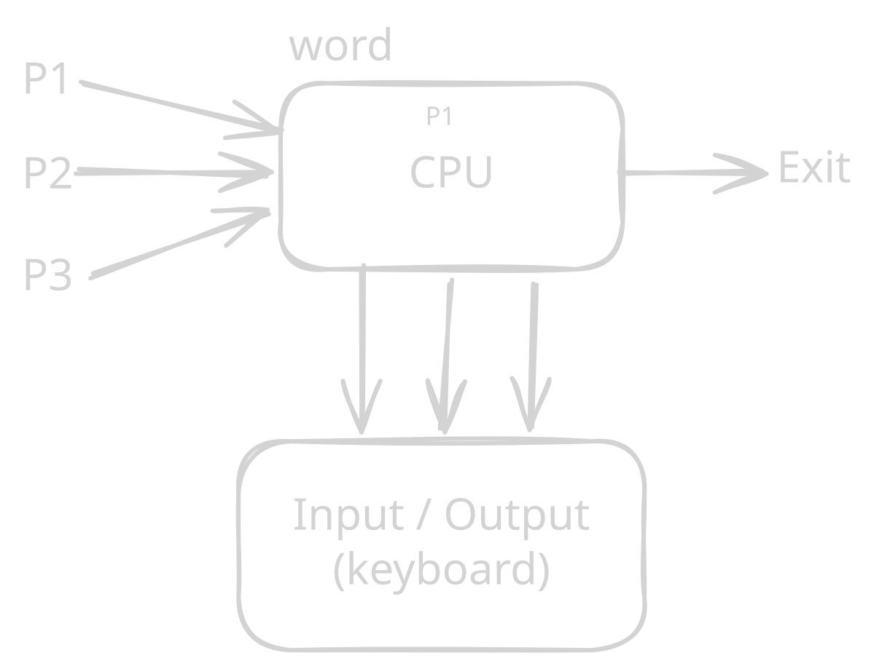
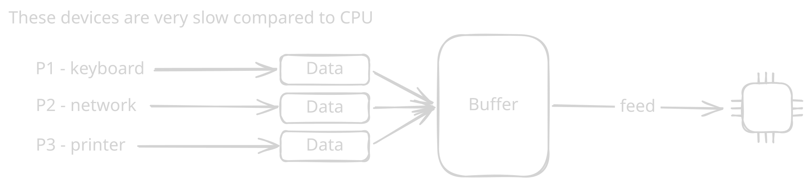
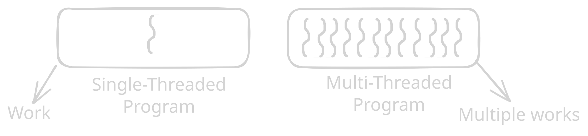
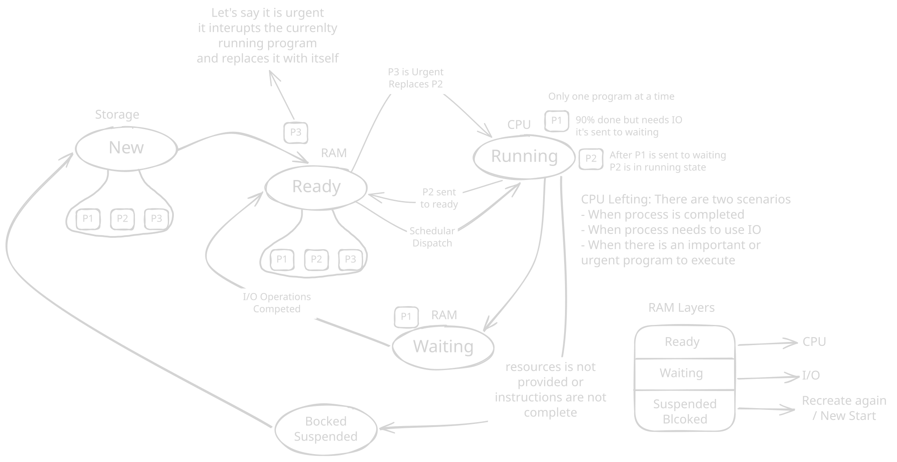
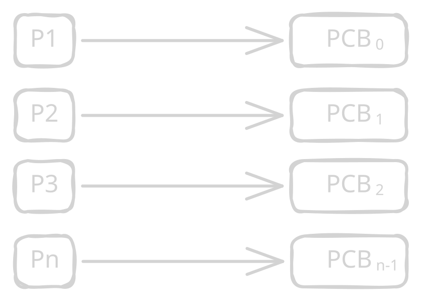

# Operating Systems Study Notes

## Section 1: Spooling & Buffering

### Definition

**Spooling (Simultaneous Peripheral Operations Online)** is a technique used by an operating system to manage slow input/output (I/O) devices efficiently. Data is temporarily stored so that the CPU does not have to wait for slow I/O devices.



### Buffer

A **buffer** is a temporary area of memory used to hold data while it is being transferred between a fast component, such as the CPU, and a slower I/O device.

- A buffer temporarily stores data during I/O operations.
- Buffers are commonly located in **RAM**.
- A buffer is not necessarily restricted to I/O devices.
- The purpose of buffering is to reduce the waiting time between components operating at different speeds.
- **Spooling** commonly uses secondary storage, such as a disk, to queue I/O jobs.



### Key Points

1. I/O devices are generally much slower than the CPU.
2. If the CPU waits for every I/O operation, CPU time is wasted.
3. Data can be temporarily stored in a buffer or spool.
4. The CPU can continue processing while I/O operations are handled.
5. Spooling is especially useful when multiple jobs need to use the same I/O device, such as a printer.

### Example / Code

**Example: Printing documents**

Suppose three processes need to print documents:

```text
P1 → Document 1 ─┐
P2 → Document 2 ─┼→ Spool/Queue → Printer
P3 → Document 3 ─┘
```

Instead of making the CPU wait for the printer to finish each document, the documents are placed in a queue. The printer processes them one by one.

### Explanation

The CPU is much faster than most I/O devices. Therefore, continuously waiting for an I/O device would reduce system performance.

With **buffering**, data is temporarily held while it moves between devices with different speeds.

With **spooling**, multiple I/O jobs can be placed into a queue, usually on secondary storage, and processed by the I/O device when it becomes available.

**Important distinction:**

- **Buffer →** temporary storage during data transfer.
- **Spooling →** queuing I/O jobs, often using secondary storage.

### Output

```text
Input/Output Devices
   ↓
Data / I/O Jobs
   ↓
Buffer or Spool Queue
   ↓
CPU / I/O Device
```


### Common Mistakes

- ❌ Saying a buffer is always located on the HDD.
- ❌ Saying a buffer is only accessible by I/O devices.
- ❌ Treating buffering and spooling as exactly the same thing.
- ❌ Saying spooling makes the I/O device itself faster.
- ✅ Remember that spooling mainly **organizes and queues I/O work**.

### Short Exam Notes

- **Spooling:** Queuing I/O jobs for efficient processing.
- **Buffer:** Temporary storage used during data transfer.
- I/O devices are slower than the CPU.
- Buffering reduces waiting caused by speed differences.
- Spooling allows multiple I/O jobs to wait in a queue.

---

# Section 2: Process Management Foundations

## Definition

A **process** is a program that is currently executing. Process management is an important responsibility of an operating system because the OS must create, schedule, control, and terminate processes.

## Key Points

### Process

A process is the **active state of a program**.

- A process is a program in execution.
- It uses system resources such as:
  - CPU
  - RAM
  - I/O devices
  - Storage

- A process changes between different states during its lifetime.
- A process normally has a relatively short lifetime.
- Each process is managed by the operating system.

### Program

A program is a **passive set of instructions stored on secondary storage**.

- It is not executing.
- It mainly occupies storage before execution.
- It does not have process states while it remains a passive program.
- A program can exist for a long time.
- When the program is loaded and executed, it becomes a process.

### Example / Code

Consider a file:

```text
calculator.exe
```

While it is simply stored on the SSD:

```text
calculator.exe → Program
```

When you run it:

```text
calculator.exe → Process
```

The operating system loads the necessary parts into memory and allocates resources to execute it.

### Explanation

The easiest way to remember the difference is:

> **Program = passive**
> **Process = active**

For example, Microsoft Word installed on your computer is a **program**. When you open Word and it starts executing, it becomes one or more **processes** managed by the operating system.

### Output

| Program                        | Process               |
| ------------------------------ | --------------------- |
| Passive                        | Active                |
| Stored on storage              | Executing             |
| Does not require CPU execution | Uses CPU              |
| Long-lived                     | Usually shorter-lived |
| Static instructions            | Has changing state    |

## Types of Processes

### 1. Operating System Processes

These processes execute code related to the operating system.

- Often run in the background.
- Perform system-level tasks.
- Help manage hardware and system services.

### 2. User Processes

These processes execute applications or other user-level programs.

- Often associated with applications used by the user.
- Execute user/application code.
- Examples include a web browser, text editor, or media player.

### Common Mistakes

- ❌ Saying a program and process are exactly the same.
- ❌ Saying a program always uses CPU resources.
- ❌ Saying every process must appear visibly on the screen.
- ✅ A background system process can execute without a visible window.

### Short Exam Notes

- **Program:** Passive set of instructions.
- **Process:** Program in execution.
- Process uses CPU, memory, I/O, and other resources.
- **OS processes:** Perform operating-system-related tasks.
- **User processes:** Execute user applications.

---

# Section 3: Threads & Units of Work

## Definition

A **thread** is the smallest unit of execution that can be scheduled by the operating system within a process.

A process can contain **one or multiple threads**.

## Key Points

- A single-threaded process has one thread of execution.
- A multithreaded process has multiple threads.
- Threads within the same process share many resources, such as the process's memory.
- Each thread has its own execution state and stack.
- Multiple threads allow different tasks to make progress concurrently.

## Example / Code

```text
Single-Threaded Process

Process
   │
   ▼
 Thread
   │
   ▼
  Work
```

```text
Multi-Threaded Process

Process
 ├── Thread 1 → Work 1
 ├── Thread 2 → Work 2
 └── Thread 3 → Work 3
```

### Explanation

Imagine a web browser.

A browser can use different threads for tasks such as:

- Handling user input
- Rendering a page
- Performing background work
- Handling network operations

This allows different tasks to make progress without requiring a separate process for each task.



### Output

```text
Single-threaded:
Process → Thread → Work

Multi-threaded:
Process → Thread 1 → Work
        → Thread 2 → Work
        → Thread 3 → Work
```

### Common Mistakes

- ❌ Saying a thread is a complete independent process.
- ❌ Saying every thread has completely separate memory.
- ❌ Saying multiple threads always execute simultaneously on one CPU core.
- ✅ Threads can execute concurrently, while true parallel execution depends on available CPU cores.

### Short Exam Notes

- **Thread = smallest unit of execution.**
- A process can contain one or multiple threads.
- Single-threaded → one execution path.
- Multithreaded → multiple execution paths.
- Threads of the same process share process resources.

---

# Section 4: Process States & Lifecycle Transitions

## Definition

A **process state** describes the current condition of a process during its execution.

The operating system moves processes between states depending on events such as CPU scheduling, I/O requests, resource availability, and completion.

## Key Points

### 1. New

The process is being created.

- The operating system creates the process.
- The process's required resources and data structures are prepared.

### 2. Ready

The process is ready to execute but is waiting for CPU time.

- Required memory/resources are available.
- The process is waiting in the ready queue.
- The scheduler selects a ready process to run.

### 3. Running

The process is currently executing on the CPU.

- The CPU is executing its instructions.
- On a single CPU core, only one thread of execution can be running at a time.

### 4. Waiting / Blocked

The process cannot continue until a particular event occurs, commonly an I/O operation.

For example:

```text
Running → Waiting
```

The process requests data from a disk and must wait until the I/O operation completes.

### 5. Terminated

The process has finished execution or has otherwise been stopped by the operating system.

- It no longer requires CPU execution.
- The OS releases its allocated resources.

## Example / Code

A simplified process lifecycle:

```text
New
 ↓
Ready
 ↓
Running
 ↓
Waiting
 ↓
Ready
 ↓
Running
 ↓
Terminated
```

### Explanation

Consider two processes, **P1** and **P2**, on a single CPU.

1. P1 is selected from the **Ready** state.
2. P1 enters **Running**.
3. P1 requests I/O.
4. P1 moves to **Waiting**.
5. The CPU can now run P2.
6. When P1's I/O completes, P1 returns to **Ready**.
7. The scheduler may later select P1 again.

A running process can also move back to **Ready** when it is preempted, for example because its time slice expires or another scheduling event occurs.

### Process State Transitions

```text
             ┌──────────────┐
             │     New      │
             └──────┬───────┘
                    ↓
             ┌──────────────┐
             │    Ready     │
             └──────┬───────┘
                    │
             Scheduler Dispatch
                    ↓
             ┌──────────────┐
             │   Running    │
             └───┬──────┬───┘
                 │      │
              I/O│      │Preemption
                 ↓      ↓
          ┌──────────┐  Ready
          │ Waiting  │
          └────┬─────┘
               │
          I/O Complete
               ↓
             Ready

Running → Terminated
```



### Common Mistakes

- ❌ Saying Ready means the process is currently executing.
- ❌ Saying Waiting means the process is waiting for CPU time.
- ❌ Saying only one process can exist at a time.
- ❌ Saying an urgent process simply "replaces" another process without scheduling/preemption.
- ✅ On a single CPU core, only one execution context runs at a time, while many processes can exist in other states.

### Short Exam Notes

- **New:** Process is being created.
- **Ready:** Waiting for CPU.
- **Running:** Executing on CPU.
- **Waiting:** Waiting for an event/I/O.
- **Terminated:** Execution has finished.
- **Running → Ready:** Preemption.
- **Running → Waiting:** I/O/event wait.
- **Waiting → Ready:** Event/I/O completed.
- **Running → Terminated:** Process finishes.

---

# Section 5: Process Control Block (PCB)

## Definition

A **Process Control Block (PCB)** is an operating-system data structure that stores important information about a process.

The OS uses the PCB to manage and control the process.

## Key Points

- Every process has an associated PCB.
- The PCB is a **data structure**, not simply a normal file.
- The operating system maintains PCBs in its protected system data structures.
- The PCB contains information needed to manage a process.
- The OS uses PCB information when scheduling, suspending, resuming, and terminating processes.
- Each process has a unique process identifier (**PID**).

## PCB Attributes

### Process ID (PID)

The **Process ID** is a unique identifier assigned to a process by the operating system.

Example:

```text
Process        PID
-------        ---
P1              0
P2              1
P3              2
...
Pn              n
```

The exact PID values and whether the first user-visible process starts at `0` depend on the operating system. Therefore, the important concept is that the OS assigns an identifier that distinguishes one process from another.

Other information commonly stored in a PCB includes:

- Process state
- Program counter
- CPU registers
- CPU scheduling information
- Memory-management information
- I/O status information

### Example / Code

A simplified conceptual PCB could look like:

```text
PCB
├── PID: 1024
├── State: Ready
├── Program Counter
├── CPU Registers
├── Scheduling Information
├── Memory Information
└── I/O Information
```

### Explanation

When the operating system creates a process, it creates and maintains a PCB for that process.

For example:

```text
P1 ─────→ PCB 1
P2 ─────→ PCB 2
P3 ─────→ PCB 3
```

If P1 is running and the OS needs to switch to P2, the OS uses the PCBs to save and restore the necessary process information. This is an important part of a **context switch**.



Place the diagram here showing:

```text
P1 → PCB
P2 → PCB
P3 → PCB
...
Pn → PCB
```

Each process has its own PCB containing its management information.

### Output

```text
Process
   ↓
Operating System
   ↓
PCB
   ├── PID
   ├── State
   ├── CPU information
   ├── Memory information
   └── I/O information
```

### Common Mistakes

- ❌ Saying the PCB is simply a file.
- ❌ Saying the PCB contains the entire program.
- ❌ Saying the PCB is stored inside the process.
- ❌ Saying PID values always begin at 0.
- ✅ PCB is an **OS-managed data structure** containing process-management information.
- ✅ Every process has an associated PCB.

### Short Exam Notes

- **PCB = Process Control Block.**
- It is an OS data structure containing process information.
- Each process has an associated PCB.
- **PID** uniquely identifies a process.
- PCB can contain:
  - Process state
  - Program counter
  - CPU registers
  - Scheduling information
  - Memory information
  - I/O information

- PCB is essential for **process management and context switching**.
