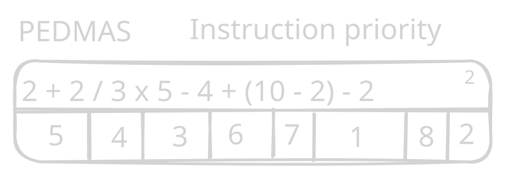
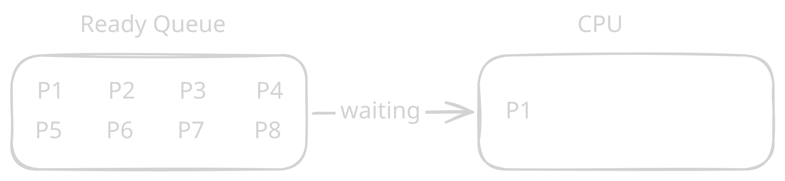

# Flow Diagram

## PCB (Process Control Block)

- Process ID
- Program Counter
- Process Priority
- PCB Pointer
- List of Open Files
- CPU Register
- Memory Management Information
- I/O Status Information
- Scheduling Information

---

## 2. Program Counter

The program counter stores information about which next instructions are going to be executed by CPU.

Priority Example in Arithmetic Operations:

---

## 3. Process Priority

The priority is a numerical value which is assigned while a process is created.

> **Note:** The lesser number, the higher its value / priority.

- Priority makes CPU/attention to process execution.

### Why does the execution prioritize processes?

For two reasons:

1. **Starvation:**
   The situation or condition where a process never gets CPU time.

2. **Consumption Resources**

### Age/Aging

- It is a technique or method of giving priority to a process until the process gets CPU Time.

> **Note:** Age increases the priority.

---

## 4. PCB Pointer

- The PCB pointer stores information about the next PCB to be executed.

---

## 5. List of Open Files

- The information of open files is stored into PCB. As once the process terminates, the open files need to be closed by OS.

---

## 6. CPU Register

- Register is a memory.
- Register is a temporary memory.
- Register is the fastest memory among all types of memories.
- Register memory is close (near) to CPU.
- CPU time unit is millisecond.
- Register time unit is nanosecond.

> [!NOTE] Time Units
>
> - 1 second = 1000 milliseconds = 1,000,000,000 nanoseconds
> - 1 millisecond = 1,000,000 nanoseconds
> - 1 second = 1000 milliseconds
> - 1 millisecond = 1000 microseconds
> - 1 microsecond = 1000 nanoseconds

### Register Types

- **AX = Accumulator Register:** Arithmetic operations or mathematical operations are stored.
- **BX = Base Register:** Logical operations are stored in here.

### Register Attributes

1. **Stack Pointer:**
   - It shows the temporary free space to CPU so that CPU can save the PCB in there.

2. **Index Register:**
   - The movement through the list.

3. **Status Flag:**
   - Flag the issues.

In very simple words we can say that registers are used to store the information of different tasks which are not currently processed like if we have a task that is currently running and due to need for input output devices it is sent to register it is basically like a checkpoint so whenever the process is loaded again to the CPU it starts from where it left off instead of restarting the whole task.

---

## 7. Memory Management Information

- The memory management information store information about process allocated how much memory or RAM.

**E.g:**

- P1 = 200MB
- P2 = 10MB
- P3 = 1.4GB
- P4 = 5MB

---

## 8. I/O Status Information

- It stores which I/O devices are allocated to a process.

**E.g:**

- P1 = Printer

- Requests of I/O by the processes.

---

## 9. Scheduling Information

- Priority
- Scheduling Queue Pointer
- Parameters (FCFS, SJF, RR)

---

# Queue = Lines

## Types

### 1. Job Queue

- All processes waits in line for getting RAM.
  

### 2. Ready Queue

- All processes are waiting to get CPU time.
  

### 3. Device I/O Queue

- All processes are waiting to get requested I/O devices.
  

### 4. Blocked/Waiting Queue

- When a program or a process is not ready to be scheduled to run.

**E.g:**

- A process is waiting for some data to be received.
